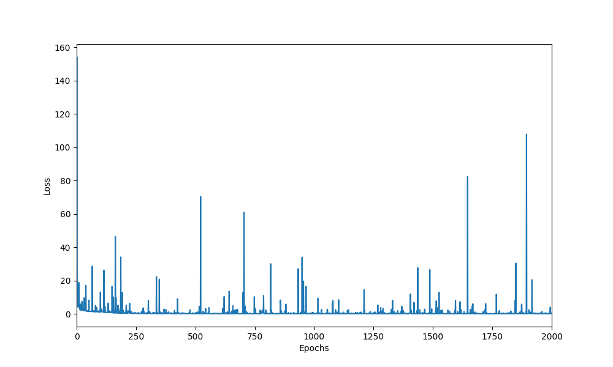

# Assignment 2

## Problem 1

Plot of training data

---

Loss vs Epochs for BGD and SGD upto 50000 epochs

---

Loss vs Epochs for BGD and SGD upto 2000 epochs

---

Learned hypothesis function with raw data.

---

$J$ with epoch for $\alpha$.

---

Same plot as above but for $alpha = 0.01$ and $alpha = 0.05$.

---

Loss with number of epochs for steepest decsent.

---

## Problem 2

Loss with number of epochs.

---

## Problem 3

Accuracy with number of epochs.

---

Cost with number of epochs.

---
