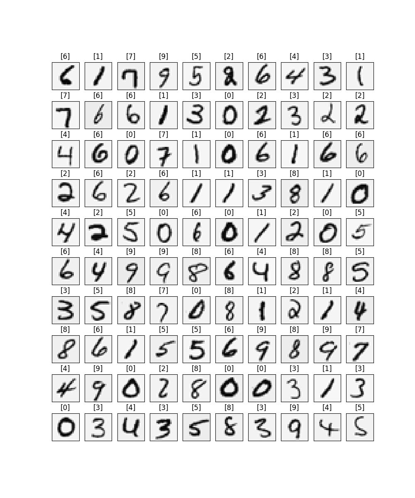
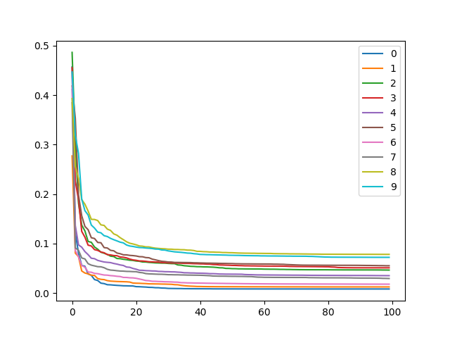
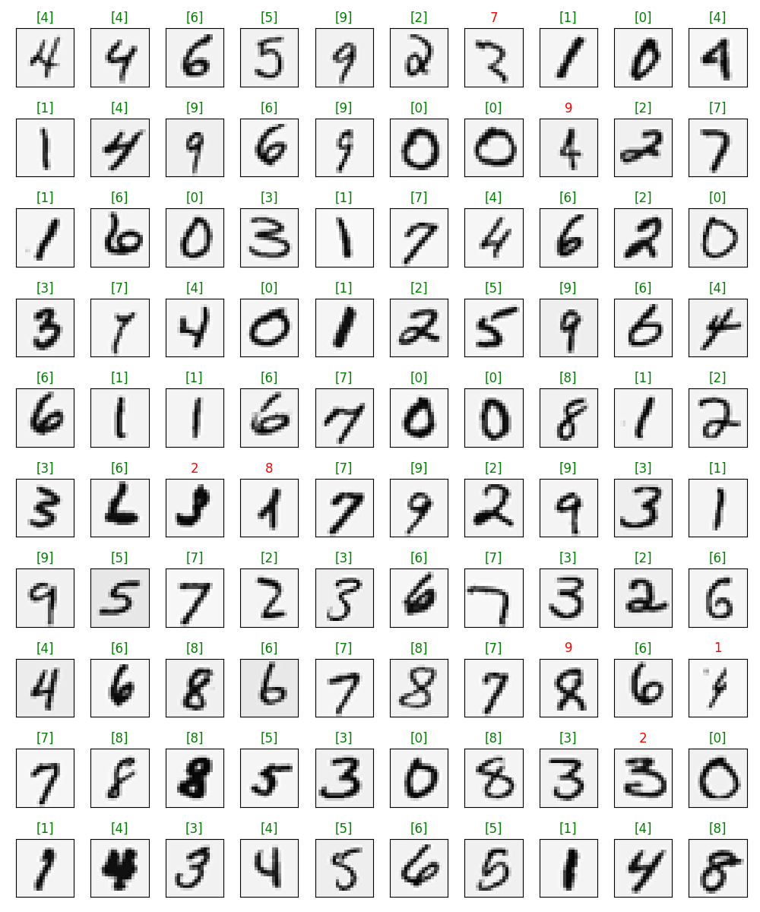
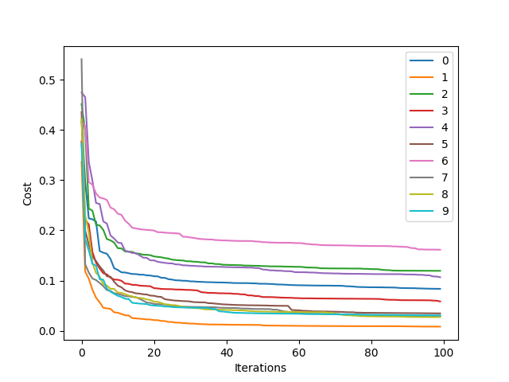
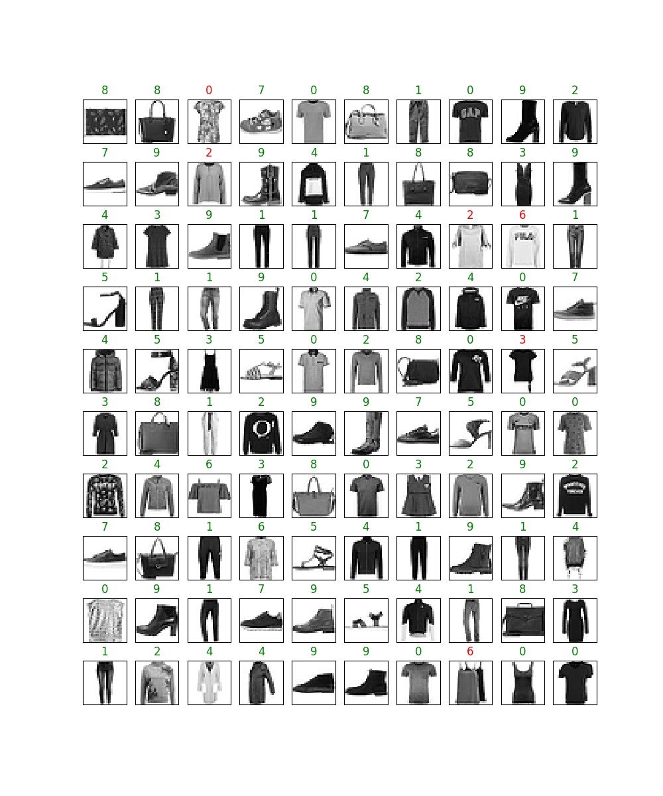
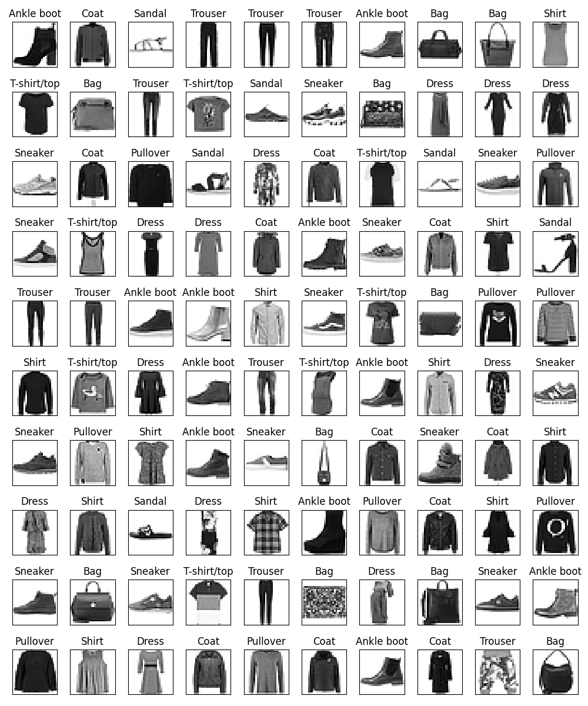
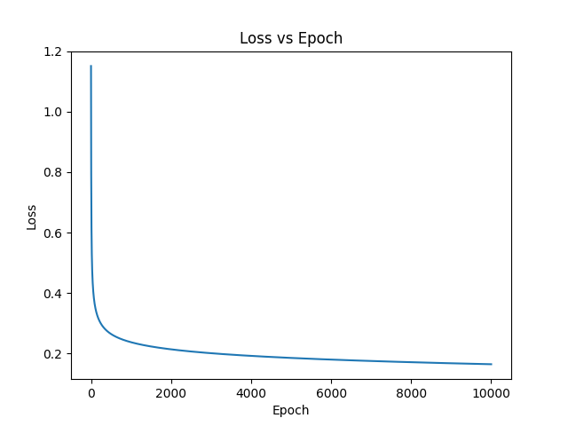
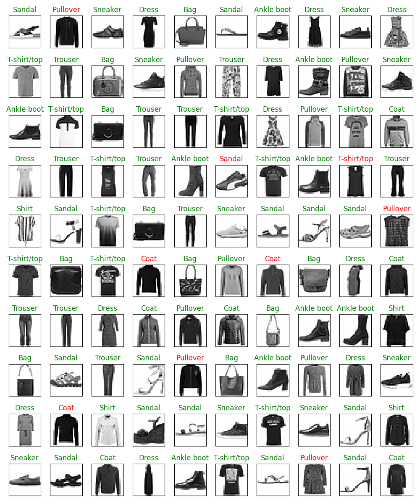

## Problem 1

100 Random samples from the MNIST digit dataset.

---

The loss with epoch for all the iterations is plotted here. We can see that the loss is decreasing with the number of epochs.

---

100 Random samples from the MNIST digit dataset is plotted along with the predicted labels. If the model is giving the correct prediction, the title of the image will be green. If the model is giving the wrong prediction, the title of the image will be red.

---

This is the loss with epoch for the fashion MNIST dataset. We are using One Vs All approach to train the model. We can see that the loss is decreasing with the number of epochs.

---

100 Random samples from the MNIST fashion dataset is plotted along with the predicted labels. If the model is giving the correct prediction, the title of the image will be green. If the model is giving the wrong prediction, the title of the image will be red.

---

## Problem 6

100 Random samples from the MNIST fashion dataset.

---

The loss with epoch for all the iterations is plotted here. We can see that the loss is decreasing with the number of epochs.

---

100 Random samples from the MNIST fashion dataset is plotted along with the predicted labels. If the model is giving the correct prediction, the title of the image will be green. If the model is giving the wrong prediction, the title of the image will be red. The model used is Softmax Regression.

---
